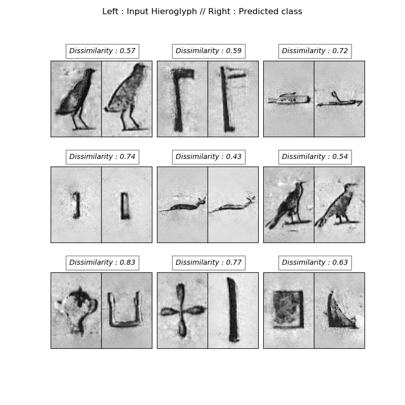

# Hieroglyphs

Personal project where I play with machine learning on Egyptian Hieroglyphs.

DBSCAN / Old implementation of a DBSCAN (clustering) algorithm to localize hieroglyphs in a picture. Not working anymore.

Currently on-going : implementation of siamese neural networks similar to face recognition (FaceNet). Using the dataset
available on https://github.com/morrisfranken/glyphreader

First try with siamese neural networks and triplet loss done in hieroRecognition.py. It's working ! 

True Hieroglyph :  N35 // Predicted :  N35 dist :  0.31444969855005006 

True Hieroglyph :  M17 // Predicted :  M1 dist :  0.7477856094253583

True Hieroglyph :  N35 // Predicted :  N35 dist :  0.5486129605025075

True Hieroglyph :  U1 // Predicted :  U1 dist :  0.7899228657901501

TO DO LIST : 
- check all the variables used and remove the useless
- implement a way to visualize the results with pictures and not the labels - in work
- improve the database used for train and test
- improve the neural network
- use the model with transfer learning already implemented (model_online) convert to RGB
- implement a contrastive loss
- write an explanation of the model 

Next step : hieroglyph localization inside picture ? 
