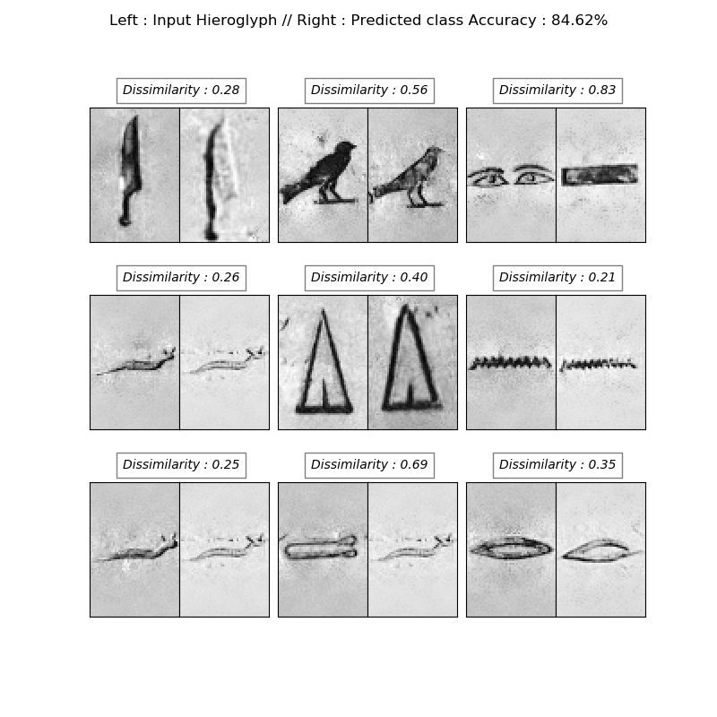
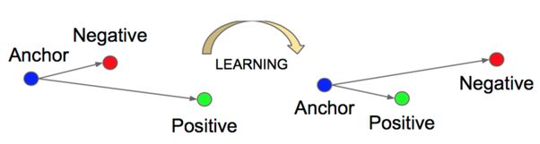

# Hieroglyphs Recognition

Personal project where I play with machine learning on Egyptian Hieroglyphs.

Currently on-going : implementation of siamese neural networks similar to face recognition (FaceNet). Using the dataset
available on https://github.com/morrisfranken/glyphreader

First try with siamese neural networks and triplet loss done in hieroRecognition.py. It's working !

DBSCAN / Old implementation of a DBSCAN (clustering) algorithm to localize hieroglyphs in a picture. Not working anymore. I will correct it when I have time !

## Facenet Siamese Network

The FaceNet model is using Siamese Networks architecture which learns to differentiate between two inputs, instead of classify them.
The network architure consists of identical neural networks with the exact same weights.
The similarity between two pictures is calculated by how close the embedding given by the network for each input pictures, as a simple euclidian distance

## Triplet loss

The objective of the siamese architecture being to differentiate pictures, a classification loss function is not adapted. A contrastive loss or triplet loss function is most suited.
The contrastive loss function uses a pair of pictures to evaluate the distance between them while the triplet loss uses... a triplet : the input picture (or anchor), a  picture of the same class (called positive)
and a picture of different class (called negative). The triple loss function minimises the distance between an anchor and a positive and maximises the distance between the anchor and a negative.

TO DO LIST : 
- check all the variables used and remove the useless
- implement a way to visualize the results with pictures and not the labels - done
- improve the neural network - in work
- improve the database used for train and test
- use the model with transfer learning already implemented (model_online) convert to RGB
- implement a contrastive loss
- write an explanation of the model 

Next step : hieroglyph localization inside picture ?

