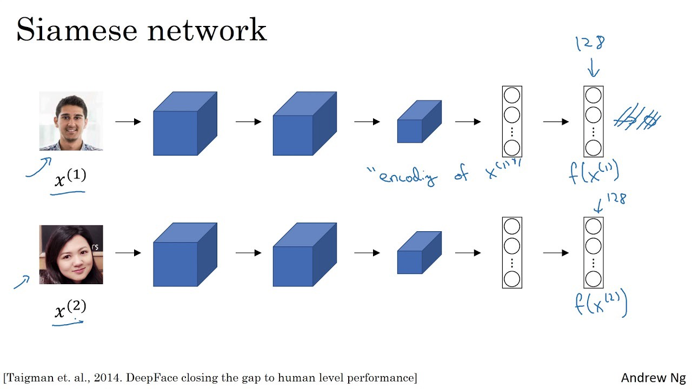
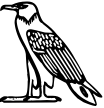
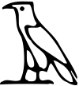
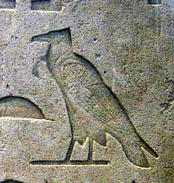

# Hieroglyphs Recognition

Personal project where I play with machine learning on Egyptian Hieroglyphs.

# How to use ! 

Just run detectHiero.ipynb  for DBSCAN hieroglyph detection on a picture. For the first time, you need to choose a specific filter as Otsu or Autocanny before applying DBSCAN (the check button) ! If not, an error will occur. And after that, you can click on Check DBSCAN on the right. 

If you want to test on your own picture, add it to the repertory examples and the name in the list examples. (I will modify this soon for automatic recognition of the files in the repertory examples). 

Packages necessarry :
- opencv
- scikit-learn
- scikit-image
- and the usual ones: matplotlib, numpy

Currently on-going : implementation of siamese neural networks similar to face recognition (FaceNet) in hieroReco notebook using the dataset available on https://github.com/morrisfranken/glyphreader

First try with siamese neural networks and triplet loss done in hieroRecognition.py. It's working !

## Facenet Siamese Network

The FaceNet model is using Siamese Networks architecture which learns to differentiate between two inputs, instead of classify them.
The network architure consists of identical neural networks with the exact same weights.
The similarity between two pictures is calculated by how close the embedding given by the network for each input pictures, as a simple euclidian distance

## Triplet loss

The objective of the siamese architecture being to differentiate pictures, a classification loss function is not adapted. A contrastive loss or triplet loss function is most suited.
The contrastive loss function uses a pair of pictures to evaluate the distance between them while the triplet loss uses... a triplet : the input picture (or anchor), a  picture of the same class (called positive)
and a picture of different class (called negative). The triple loss function minimises the distance between an anchor and a positive and maximises the distance between the anchor and a negative.

TO DO LIST : 
- check all the variables used and remove the useless
- implement a way to visualize the results with pictures and not the labels - done
- improve the neural network - in work
- improve the database used for train and test
- use the model with transfer learning already implemented (model_online) convert to RGB
- implement a contrastive loss
- write an explanation of the model 

## Future: TinyYOLO

Next step: hieroglyph localization inside picture with tinyYolo ?

## Future: Projet Rosette

How to use the database available on http://projetrosette.info ?

 

Is it better to use clean hieroglyphs, only pictures (but not always available), both ?

